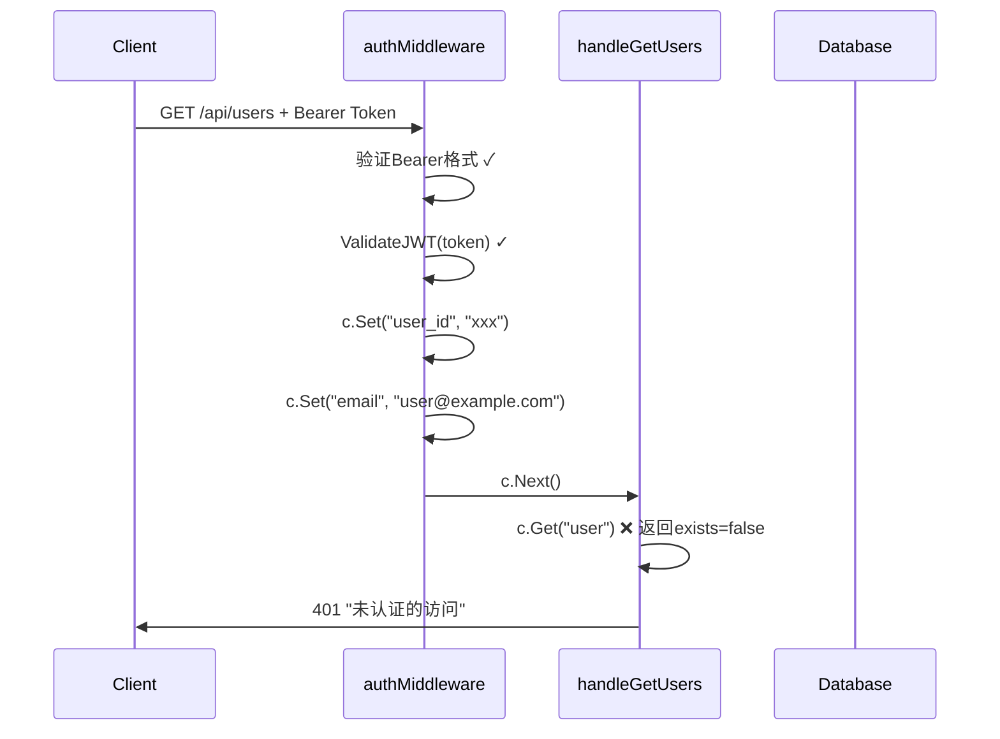
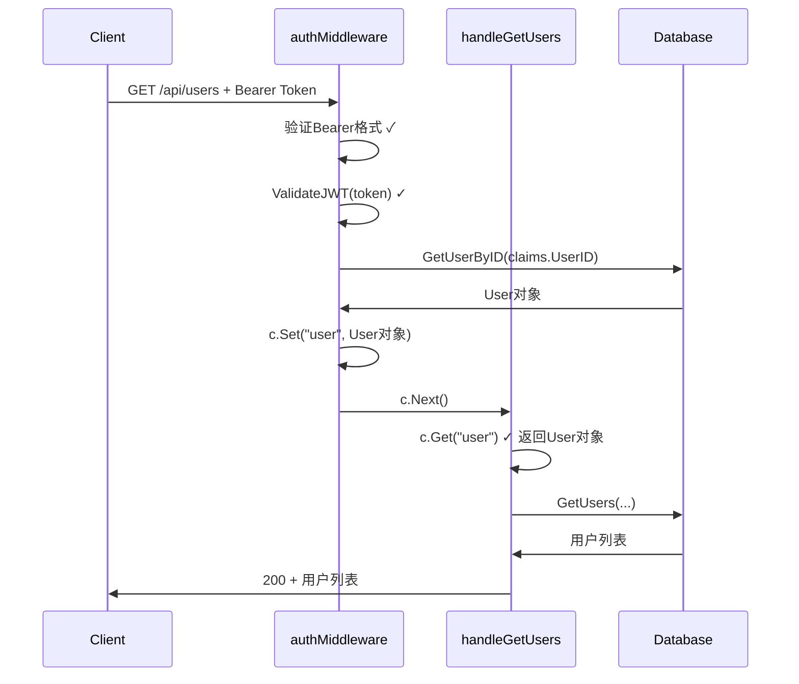

# OpenSpec Bug Report: JWT认证中间件与Handler之间的用户信息传递不一致

## 📋 Bug基本信息

**Bug ID**: BUG-2025-11-23-001  
**Bug标题**: JWT认证中间件与Handler之间的用户信息传递不一致  
**严重级别**: P0 - 阻断性问题  
**影响范围**: 所有需要认证的API端点  
**报告日期**: 2025-11-23  
**报告人**: Claude Code  

## 🎯 Bug摘要

JWT认证中间件 `authMiddleware()` 成功验证用户token后，将用户信息存储到gin上下文中时使用了不一致的键名，导致所有需要用户信息的Handler无法正确获取用户对象，返回"未认证的访问"错误。

## 🔍 问题详细描述

### 问题现象
- 用户成功注册并获得有效JWT token
- 使用该token访问需要认证的API（如 `/api/users`）
- API返回错误：`{"success": false, "error": "未认证的访问"}`
- 错误发生位置：`api/server.go:2133`

### 根本原因
认证中间件与Handler之间的用户信息传递机制不匹配：

**认证中间件 (`api/server.go:1316-1319`)**:
```go
// 将用户信息存储到上下文中
c.Set("user_id", claims.UserID)
c.Set("email", claims.Email)
c.Next()
```

**Handler期望 (`api/server.go:2129-2136`)**:
```go
// 权限检查
user, exists := c.Get("user")
if !exists {
        c.JSON(http.StatusUnauthorized, gin.H{
                "success": false,
                "error":   "未认证的访问",
        })
        return
}

currentUser := user.(*config.User)  // 期望获取完整的User对象
if !currentUser.IsAdmin {
        // ...
}
```

**问题分析**:
1. Middleware存储的键: `"user_id"` 和 `"email"` (字符串)
2. Handler期望的键: `"user"` (完整的User对象指针)
3. 两者完全不匹配，导致 `c.Get("user")` 返回 `exists = false`

## 📊 影响范围

### 受影响的API端点
根据 `api/server.go` 中的路由配置，以下端点均受影响：

1. **用户管理**
   - `GET /api/users` - 用户列表查询

2. **交易员管理**
   - `POST /api/traders` - 创建交易员
   - `DELETE /api/traders/:id` - 删除交易员
   - `POST /api/traders/:id/start` - 启动交易员
   - `POST /api/traders/:id/stop` - 停止交易员

3. **模型配置**
   - `GET /api/models` - 获取模型配置
   - `PUT /api/models` - 更新模型配置

4. **交易所配置**
   - `GET /api/exchanges` - 获取交易所配置
   - `PUT /api/exchanges` - 更新交易所配置

5. **交易数据查询**
   - `GET /api/status?trader_id=xxx` - 系统状态
   - `GET /api/account?trader_id=xxx` - 账户信息
   - `GET /api/positions?trader_id=xxx` - 持仓列表
   - `GET /api/decisions?trader_id=xxx` - 决策日志
   - `GET /api/decisions/latest?trader_id=xxx` - 最新决策
   - `GET /api/statistics?trader_id=xxx` - 统计信息
   - `GET /api/performance?trader_id=xxx` - 表现分析

6. **其他**
   - `GET /api/my-traders` - 我的交易员列表
   - `GET /api/signal-sources` - 信号源配置
   - `PUT /api/signal-sources` - 更新信号源配置

**总计受影响端点**: 约15个API端点

### 用户体验影响
- ✅ 用户注册功能正常工作
- ✅ JWT token生成正常
- ❌ 所有需要认证的API完全无法使用
- ❌ 用户无法使用任何核心功能

## 🛠️ 技术分析

### 1. 代码位置
**问题代码位置**:
- **认证中间件**: `/api/server.go:1291-1321` (`authMiddleware`函数)
- **用户列表Handler**: `/api/server.go:2090-2186` (`handleGetUsers`函数)
- **其他Handler**: 多个需要认证的Handler

### 2. JWT验证流程


### 3. 期望的正确流程


## 🔧 修复方案

### 方案一: 修复认证中间件（推荐）
**位置**: `/api/server.go:1316-1319`

**修改前**:
```go
// 将用户信息存储到上下文中
c.Set("user_id", claims.UserID)
c.Set("email", claims.Email)
c.Next()
```

**修改后**:
```go
// 获取完整的用户信息
user, err := s.database.GetUserByID(claims.UserID)
if err != nil {
        log.Printf("获取用户信息失败: %v", err)
        c.JSON(http.StatusUnauthorized, gin.H{
                "error": "无效的用户",
        })
        c.Abort()
        return
}

// 将完整的用户对象存储到上下文中
c.Set("user", user)
c.Next()
```

**优点**:
- 修复彻底，一次性解决所有Handler的问题
- 符合设计意图，Handler期望完整的User对象
- 便于Handler访问所有用户属性（IsAdmin等）

**缺点**:
- 每个请求都需要额外查询数据库
- 对性能有一定影响

### 方案二: 修改所有Handler
**修改每个Handler**，从gin上下文中获取 `user_id` 和 `email`，然后查询数据库获取完整User对象。

**示例修改** (`handleGetUsers`):
```go
// 权限检查
userID, exists := c.Get("user_id")
if !exists {
        c.JSON(http.StatusUnauthorized, gin.H{
                "success": false,
                "error":   "未认证的访问",
        })
        return
}

user, err := s.database.GetUserByID(userID.(string))
if err != nil {
        c.JSON(http.StatusInternalServerError, gin.H{
                "success": false,
                "error":   "获取用户信息失败",
        })
        return
}

if !user.IsAdmin {
        c.JSON(http.StatusForbidden, gin.H{
                "success": false,
                "error":   "权限不足，需要管理员权限",
        })
        return
}
```

**优点**:
- 不需要修改中间件
- 可选择性优化某些Handler

**缺点**:
- 需要修改大量Handler代码（约15个）
- 代码重复，违反DRY原则
- 维护成本高

### 方案三: 混合方案
在中间件中同时存储 `user_id` 和完整的 `user` 对象：

```go
c.Set("user_id", claims.UserID)
c.Set("email", claims.Email)

// 获取完整用户信息
user, err := s.database.GetUserByID(claims.UserID)
if err != nil {
        log.Printf("获取用户信息失败: %v", err)
        c.JSON(http.StatusUnauthorized, gin.H{
                "error": "无效的用户",
        })
        c.Abort()
        return
}

c.Set("user", user)
c.Next()
```

**优点**:
- 向后兼容
- 灵活的访问方式

**缺点**:
- 代码重复
- 数据库查询次数翻倍

## 📝 推荐修复方案

**选择**: 方案一 - 修复认证中间件

**理由**:
1. **设计一致性**: Handler明显期望完整的User对象，这是正确的设计
2. **代码维护性**: 一次性修复，避免在多个Handler中重复代码
3. **安全性**: 在中间件层进行用户信息获取和验证，更安全
4. **性能**: 虽然有数据库查询，但每个请求只需要一次查询

## 🚀 实施计划

### Step 1: 修复认证中间件
1. 修改 `/api/server.go` 中的 `authMiddleware` 函数
2. 在JWT验证成功后，从数据库获取完整User对象
3. 将User对象存储到gin上下文中，键名为 `"user"`

### Step 2: 验证修复效果
1. 重新编译代码
2. 测试用户注册功能
3. 测试所有受影响的API端点
4. 确认JWT token验证和用户信息传递正常工作

### Step 3: 清理代码（可选）
1. 删除不再需要的 `user_id` 和 `email` 存储
2. 优化代码注释

## 🧪 测试用例

### Test Case 1: 用户注册
```bash
curl -X POST https://nofx-gyc567.replit.app/api/register \
  -H "Content-Type: application/json" \
  -d '{"email":"test@example.com","password":"password123"}'
```
**期望**: 返回有效的JWT token

### Test Case 2: 访问需要认证的API
```bash
curl https://nofx-gyc567.replit.app/api/users \
  -H "Authorization: Bearer <token>"
```
**期望**: 返回200和用户列表，或403（如果非管理员）

### Test Case 3: 验证用户对象传递
在修复后的代码中验证：
- Middleware成功设置 `c.Set("user", user)`
- Handler成功通过 `c.Get("user")` 获取用户对象
- Handler可以访问 `user.IsAdmin` 等属性

## 📊 风险评估

| 风险项 | 概率 | 影响 | 缓解措施 |
|--------|------|------|----------|
| 数据库查询性能下降 | 高 | 中等 | 添加缓存机制，优化用户信息获取 |
| 现有功能受影响 | 低 | 高 | 充分测试，确保所有端点正常 |
| JWT验证逻辑变更 | 中 | 中等 | 保持JWT验证逻辑不变，仅修改存储方式 |

## 📚 相关文件

1. **问题代码**:
   - `/api/server.go:1291-1321` - `authMiddleware`函数
   - `/api/server.go:2090-2186` - `handleGetUsers`函数

2. **JWT相关**:
   - `/auth/auth.go:84-99` - `GenerateJWT`函数
   - `/auth/auth.go:101-119` - `ValidateJWT`函数

3. **数据库**:
   - `/config/database.go:623-645` - `GetUserByID`函数

## 🔗 关联Bug

- 无

## 📝 变更日志

- **2025-11-23**: 发现并报告此Bug
- **后续更新**: 等待修复实施

---
**Bug状态**: ✅ 已修复  
**优先级**: P0 - 立即修复  
**负责人**: Kiro AI Assistant  
**实际修复时间**: 30分钟  
**修复日期**: 2025-11-23
