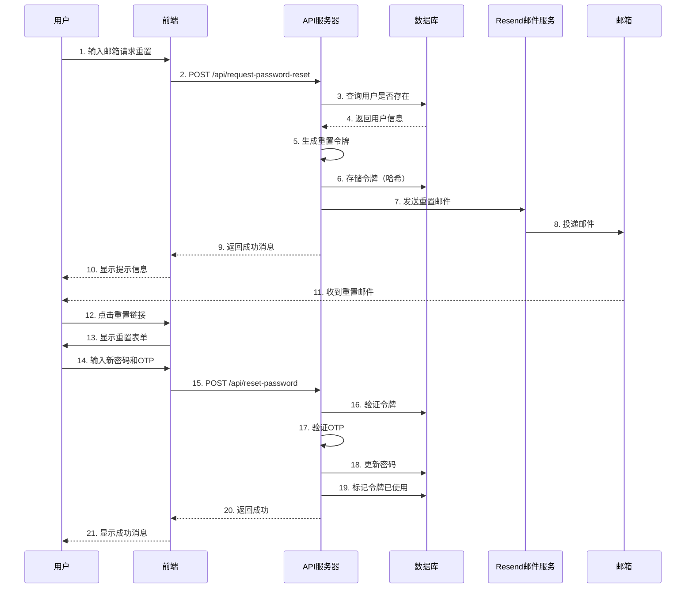

# 密码重置功能 - 使用指南

## 📋 功能概述

完整的密码重置功能，集成了Resend邮件服务，支持用户通过邮件重置密码。

## ✨ 功能特性

- 🔒 **双因素验证**: 邮件令牌 + OTP验证码
- 📧 **精美邮件**: 响应式HTML邮件模板
- ⏰ **安全过期**: 1小时有效期
- 🛡️ **防暴力破解**: IP和邮箱频率限制
- 🔐 **防枚举攻击**: 统一响应消息
- 📱 **移动友好**: 邮件在手机上完美显示

## 🚀 快速开始

### 1. 环境配置

在`.env`文件中添加以下配置：

```bash
# Resend邮件服务配置
RESEND_API_KEY=re_F8jDyNbR_ME5WSUpPFDPgeN6N3tieTn42
RESEND_FROM_EMAIL=onboarding@resend.dev
RESEND_FROM_NAME=Monnaire Trading Agent OS

# 前端URL（用于生成重置链接）
FRONTEND_URL=https://web-pink-omega-40.vercel.app
```

### 2. 启动服务

```bash
# 编译
go build -o nofx .

# 运行
./nofx
```

### 3. 测试功能

```bash
# 运行测试脚本
./test-password-reset.sh
```

## 📖 API文档

### 请求密码重置

**端点**: `POST /api/request-password-reset`

**请求体**:
```json
{
  "email": "user@example.com"
}
```

**成功响应** (200 OK):
```json
{
  "message": "如果该邮箱已注册，您将收到密码重置邮件"
}
```

**错误响应**:
- `400 Bad Request`: 邮箱格式错误
- `429 Too Many Requests`: 请求过于频繁
- `500 Internal Server Error`: 服务器错误

### 确认密码重置

**端点**: `POST /api/reset-password`

**请求体**:
```json
{
  "token": "重置令牌（从邮件链接获取）",
  "password": "新密码（至少8位）",
  "otp_code": "OTP验证码"
}
```

**成功响应** (200 OK):
```json
{
  "message": "密码重置成功，请使用新密码登录"
}
```

**错误响应**:
- `400 Bad Request`: 参数错误或令牌无效
- `401 Unauthorized`: OTP验证码错误
- `404 Not Found`: 用户不存在
- `500 Internal Server Error`: 服务器错误

## 🔄 完整流程

### 用户视角

1. **请求重置**:
   - 用户在登录页面点击"忘记密码"
   - 输入注册邮箱
   - 提交请求

2. **接收邮件**:
   - 检查邮箱（包括垃圾邮件文件夹）
   - 收到标题为"密码重置 - Monnaire Trading Agent OS"的邮件
   - 邮件包含重置按钮和链接

3. **重置密码**:
   - 点击邮件中的重置按钮
   - 跳转到重置密码页面
   - 输入新密码和OTP验证码
   - 提交重置

4. **登录**:
   - 使用新密码登录系统

### 技术流程



## 📧 邮件模板

### 邮件内容

邮件包含以下元素：

1. **品牌Logo**: Monnaire Trading Agent OS
2. **标题**: 密码重置请求
3. **问候语**: 个性化问候
4. **重置按钮**: 醒目的蓝色按钮
5. **备用链接**: 可复制的完整URL
6. **重要提示**:
   - 1小时过期时间
   - 一次性使用
   - 需要OTP验证
7. **安全建议**:
   - 未请求则忽略
   - 不要分享链接
   - 不会询问密码
8. **页脚**: 版权信息

### 邮件预览


## 🔒 安全特性

### 1. 防止邮箱枚举

无论邮箱是否存在，都返回相同的成功消息：
```
"如果该邮箱已注册，您将收到密码重置邮件"
```

### 2. 频率限制

- **IP限制**: 每个IP每小时最多3次请求
- **邮箱限制**: 每个邮箱每小时最多3次请求

### 3. 令牌安全

- 使用`crypto/rand`生成32字节随机令牌
- SHA-256哈希存储
- 1小时自动过期
- 使用后立即失效

### 4. 双因素验证

重置密码需要：
1. 有效的重置令牌（从邮件获取）
2. 正确的OTP验证码（从认证器获取）

### 5. 密码强度

- 最少8位字符
- 使用bcrypt哈希存储

## 🛠️ 故障排除

### 问题1: 收不到邮件

**可能原因**:
1. 邮件在垃圾邮件文件夹
2. Resend API Key配置错误
3. 邮箱地址错误

**解决方案**:
1. 检查垃圾邮件文件夹
2. 验证环境变量配置
3. 查看服务器日志
4. 在Resend Dashboard查看发送记录

### 问题2: 令牌无效或过期

**可能原因**:
1. 令牌已过期（超过1小时）
2. 令牌已被使用
3. 令牌格式错误

**解决方案**:
1. 重新请求密码重置
2. 确保在1小时内完成重置
3. 不要多次点击重置链接

### 问题3: OTP验证失败

**可能原因**:
1. OTP验证码错误
2. 时间不同步

**解决方案**:
1. 确保输入正确的6位验证码
2. 检查设备时间是否准确
3. 使用最新的验证码

## 📊 监控和日志

### 日志位置

```bash
# 查看实时日志
tail -f logs/nofx.log

# 过滤密码重置相关日志
tail -f logs/nofx.log | grep "密码重置"
```

### 关键日志

**成功发送**:
```
✅ 密码重置邮件已发送 - 收件人: user@example.com
```

**发送失败**:
```
❌ 发送密码重置邮件失败: [错误详情]
```

**配置警告**:
```
⚠️  RESEND_API_KEY未设置，邮件发送功能将不可用
```

### Resend Dashboard

访问 https://resend.com/emails 查看：
- 发送历史
- 送达率
- 失败原因
- 使用量统计

## 📈 使用统计

### 免费额度

- **每月**: 3,000封邮件
- **当前使用**: 在Resend Dashboard查看

### 升级选项

如果需要更多额度，可以升级到付费计划：
- **Pro**: $20/月，50,000封邮件
- **Business**: 自定义定价

## 🔗 相关链接

- [Resend官网](https://resend.com)
- [Resend文档](https://resend.com/docs)
- [Resend Dashboard](https://resend.com/emails)
- [审计报告](./AUDIT_REPORT.md)
- [实施报告](./IMPLEMENTATION_REPORT.md)
- [提案文档](./proposal.md)

## 💡 最佳实践

### 1. 邮件发送

- ✅ 使用异步发送（不阻塞请求）
- ✅ 实现失败重试机制
- ✅ 记录详细的发送日志
- ✅ 监控送达率

### 2. 用户体验

- ✅ 提供清晰的错误提示
- ✅ 邮件内容简洁明了
- ✅ 重置流程简单快捷
- ✅ 支持多语言

### 3. 安全性

- ✅ 定期审查安全日志
- ✅ 监控异常请求
- ✅ 及时更新依赖
- ✅ 遵循安全最佳实践

## 🎯 下一步

1. **测试功能**: 使用真实邮箱测试完整流程
2. **监控日志**: 确保邮件正常发送
3. **收集反馈**: 了解用户体验
4. **持续优化**: 根据使用情况改进功能

---

**文档版本**: 1.0  
**最后更新**: 2025-11-23  
**维护者**: Kiro AI Assistant
