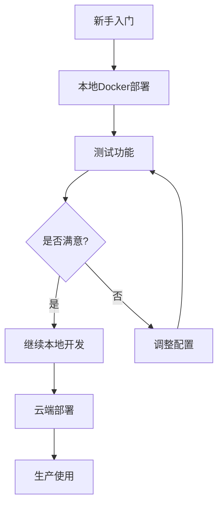

# 🤖 Monnaire Trading Agent OS新手指南 - 从零开始部署和运行

> **专为新手编写 | 图文并茂 | 零基础也能部署** 📚
>
> 作者：Claude Code助手
>
> 适用版本：Monnaire Trading Agent OS v1.0+
>
> 预计完成时间：30-60分钟

---

## 📋 目录

- [1. 简介与概述](#1-简介与概述)
- [2. 系统要求](#2-系统要求)
- [3. 获取API密钥](#3-获取api密钥)
- [4. 方案选择](#4-方案选择)
- [5. 本地部署教程](#5-本地部署教程)
- [6. 云服务器部署教程](#6-云服务器部署教程)
- [7. 配置详解](#7-配置详解)
- [8. 故障排除](#8-故障排除)
- [9. 高级配置](#9-高级配置)
- [10. 维护与更新](#10-维护与更新)
- [11. 安全建议](#11-安全建议)
- [12. 常见问题](#12-常见问题)

---

## 1. 简介与概述

### 1.1 什么是Monnaire Trading Agent OS？

Monnaire Trading Agent OS是一个基于AI的加密货币期货自动交易系统，支持：
- **多AI模型**：DeepSeek、Qwen等
- **多交易所**：Binance、Hyperliquid、Aster DEX
- **多交易策略**：全自动AI交易，无需人工干预
- **实时监控**：专业的Web界面
- **竞赛模式**：多AI实盘对战

### 1.2 系统架构

```
┌─────────────────────────────────────────────┐
│             前端 (React + Vite)              │
│              端口: 3000                      │
│           负责展示和交互                      │
└────────────────┬────────────────────────────┘
                 │ API请求
                 ↓
┌─────────────────────────────────────────────┐
│             后端 (Go + Gin)                  │
│              端口: 8080                      │
│         负责业务逻辑和AI决策                  │
└────────────────┬────────────────────────────┘
                 │ 交易API
                 ↓
┌─────────────────────────────────────────────┐
│            交易所 (Binance等)                │
│         实际执行交易操作                      │
└─────────────────────────────────────────────┘
```

### 1.3 核心文件结构

```
nofx/
├── main.go                    # 程序入口
├── config.json                # 主配置文件
├── .env                       # 环境变量
│
├── web/                       # 前端代码
│   ├── src/                   # React源码
│   ├── package.json           # 前端依赖
│   └── dist/                  # 构建输出
│
├── decision/                  # AI决策引擎
│   └── engine.go              # 双提示词架构
│
├── trader/                    # 交易模块
│   ├── auto_trader.go         # 自动交易
│   └── binance_futures.go     # 币安API
│
├── market/                    # 市场数据
│   └── data.go                # K线、技术指标
│
├── pool/                      # 币种池
│   └── coin_pool.go           # AI500 + OI Top
│
└── logger/                    # 日志系统
    └── decision_logger.go     # 交易记录
```

---

## 2. 系统要求

### 2.1 硬件要求

| 组件 | 最低配置 | 推荐配置 |
|------|----------|----------|
| **CPU** | 1核心 | 2核心+ |
| **内存** | 2GB | 4GB+ |
| **硬盘** | 5GB | 20GB+ |
| **网络** | 10Mbps | 50Mbps+ |

### 2.2 软件依赖

#### 必备软件

| 软件 | 版本要求 | 用途 |
|------|----------|------|
| **Git** | 任意版本 | 代码管理 |
| **Docker** | 20.10+ | 容器化部署 |
| **Docker Compose** | 2.0+ | 多容器编排 |
| **Go** | 1.25+ | 后端开发 |
| **Node.js** | 18+ | 前端开发 |
| **npm** | 任意版本 | 包管理 |

#### 可选软件

| 软件 | 用途 |
|------|------|
| **PM2** | 进程管理 |
| **Nginx** | 反向代理 |
| **Nvidia-Docker** | GPU加速（如需要） |

### 2.3 安装依赖

#### macOS

```bash
# 安装 Homebrew（如果未安装）
/bin/bash -c "$(curl -fsSL https://raw.githubusercontent.com/Homebrew/install/HEAD/install.sh)"

# 安装 Git
brew install git

# 安装 Docker Desktop
# 访问 https://www.docker.com/products/docker-desktop 下载安装

# 安装 Go
brew install go

# 安装 Node.js
brew install node

# 安装 PM2（可选）
npm install -g pm2
```

#### Ubuntu/Debian

```bash
# 更新包列表
sudo apt update

# 安装 Git
sudo apt install -y git

# 安装 Docker
curl -fsSL https://get.docker.com -o get-docker.sh
sudo sh get-docker.sh
sudo usermod -aG docker $USER

# 安装 Docker Compose
sudo apt install -y docker-compose-plugin

# 安装 Go
wget https://go.dev/dl/go1.25.linux-amd64.tar.gz
sudo tar -C /usr/local -xzf go1.25.linux-amd64.tar.gz
echo 'export PATH=$PATH:/usr/local/go/bin' >> ~/.bashrc
source ~/.bashrc

# 安装 Node.js
curl -fsSL https://deb.nodesource.com/setup_18.x | sudo -E bash -
sudo apt install -y nodejs

# 安装 PM2（可选）
sudo npm install -g pm2
```

#### Windows

1. **Git**: 下载 [Git for Windows](https://git-scm.com/download/win)
2. **Docker Desktop**: 下载 [Docker Desktop for Windows](https://www.docker.com/products/docker-desktop)
3. **Go**: 下载 [Go for Windows](https://go.dev/dl/)
4. **Node.js**: 下载 [Node.js for Windows](https://nodejs.org/)

### 2.4 验证安装

```bash
# 检查所有依赖
git --version
docker --version
docker compose version  # 注意：使用空格
go version
node --version
npm --version

# 如果全部显示版本号，说明安装成功！
```

---

## 3. 获取API密钥

在配置系统之前，你需要获取以下API密钥。

### 3.1 DeepSeek AI密钥（必需）

**用途**：驱动AI交易决策

**获取步骤**：
1. 访问 [DeepSeek平台](https://platform.deepseek.com/)
2. 注册账户并完成实名认证
3. 进入控制台 → API密钥管理
4. 创建新密钥，复制保存

**费用**：新用户有免费额度，后续按使用量计费

### 3.2 币安API密钥（推荐）

**用途**：连接币安交易所进行实际交易

**获取步骤**：
1. 登录 [币安账户](https://www.binance.com/)
2. 进入个人中心 → API管理
3. 创建新API密钥
4. 设置权限：
   - ✅ 读取信息
   - ✅ 期货交易
   - ❌ 提现（安全考虑）
5. 保存API Key和Secret Key

**重要**：
- 币安需要开启双向持仓模式（详见[常见问题](#12-常见问题)）
- 建议创建子账户进行测试

### 3.3 Hyperliquid API（可选）

**用途**：连接Hyperliquid去中心化交易所

**获取步骤**：
1. 生成以太坊私钥（用于签名交易）
2. 记录私钥和钱包地址

**注意**：
- Hyperliquid是去中心化交易所
- 无需API Key，只需私钥
- 更安全，但生态较小

### 3.4 Aster API（可选）

**用途**：连接Aster DEX去中心化交易所

**获取步骤**：
1. 访问 [Aster API钱包](https://www.asterdex.com/en/api-wallet)
2. 连接主钱包
3. 创建API钱包
4. 复制Signer地址和私钥

---

## 4. 方案选择

Monnaire Trading Agent OS支持多种部署方式，请根据需求选择：

### 4.1 部署方案对比

| 方案 | 难度 | 成本 | 适用场景 | 推荐度 |
|------|------|------|----------|--------|
| **本地Docker** | ⭐ | 🆓 | 开发测试 | ⭐⭐⭐⭐⭐ |
| **PM2本地** | ⭐⭐ | 🆓 | 开发调试 | ⭐⭐⭐ |
| **Vercel+Railway** | ⭐⭐ | 🆓/💰 | 生产部署 | ⭐⭐⭐⭐⭐ |
| **云服务器** | ⭐⭐⭐ | 💰💰 | 企业使用 | ⭐⭐⭐ |
| **Docker Swarm** | ⭐⭐⭐⭐ | 💰💰 | 大规模部署 | ⭐⭐ |

### 4.2 新手推荐路线



**建议流程**：
1. **第1步**：本地Docker部署（10分钟）
2. **第2步**：熟悉功能（20分钟）
3. **第3步**：云端部署（30分钟）
4. **第4步**：生产使用

---

## 5. 本地部署教程

### 5.1 方案A：Docker一键部署（推荐⭐⭐⭐⭐⭐）

**优势**：
- ✅ 最简单，3步完成
- ✅ 隔离性好
- ✅ 支持所有平台
- ✅ 一键启动/停止

#### 步骤1：克隆项目

```bash
# 克隆代码（替换为你的仓库地址）
git clone https://github.com/yourusername/nofx.git
cd nofx

# 或直接下载压缩包并解压
```

#### 步骤2：配置环境

```bash
# 1. 复制环境变量模板
cp .env.example .env

# 2. 复制配置文件模板
cp config.json.example config.json

# 3. 编辑配置文件
nano config.json  # 或使用其他编辑器
```

**config.json配置示例**：

```json
{
  "traders": [
    {
      "id": "my_trader",
      "name": "My First AI Trader",
      "enabled": true,
      "ai_model": "deepseek",
      "exchange": "binance",
      "binance_api_key": "YOUR_BINANCE_API_KEY",
      "binance_secret_key": "YOUR_BINANCE_SECRET_KEY",
      "deepseek_key": "YOUR_DEEPSEEK_KEY",
      "initial_balance": 1000.0,
      "scan_interval_minutes": 3,
      "btc_eth_leverage": 5,
      "altcoin_leverage": 5
    }
  ],
  "leverage": {
    "btc_eth_leverage": 5,
    "altcoin_leverage": 5
  },
  "use_default_coins": true,
  "default_coins": [
    "BTCUSDT",
    "ETHUSDT",
    "SOLUSDT"
  ],
  "api_server_port": 8080,
  "max_daily_loss": 10.0,
  "max_drawdown": 20.0,
  "stop_trading_minutes": 60
}
```

#### 步骤3：启动服务

```bash
# 一键启动（首次会构建镜像）
./start.sh start --build

# 或者使用原生命令
docker compose up -d --build
```

#### 步骤4：验证部署

```bash
# 查看容器状态
./start.sh status

# 查看日志
./start.sh logs

# 访问Web界面
# 打开浏览器访问：http://localhost:3000
```

**成功标志**：
- 看到Web界面正常加载
- 控制台显示交易状态
- 无错误日志

### 5.2 方案B：PM2开发部署

**优势**：
- ✅ 热重载，修改代码无需重启
- ✅ 实时查看日志
- ✅ 资源占用低
- ❌ 需要手动管理依赖

#### 步骤1：安装PM2

```bash
npm install -g pm2
```

#### 步骤2：编译后端

```bash
# 安装Go依赖
go mod download

# 编译后端
go build -o nofx .
```

#### 步骤3：安装前端依赖

```bash
cd web
npm install
cd ..
```

#### 步骤4：启动服务

```bash
# 启动前后端
./pm2.sh start

# 查看状态
./pm2.sh status

# 查看日志
./pm2.sh logs
```

#### 步骤5：访问

- 前端：http://localhost:3000
- 后端：http://localhost:8080

### 5.3 本地部署常见问题

#### 问题1：Docker构建失败

```bash
# 清理Docker缓存
docker system prune -a

# 重新构建
./start.sh start --build
```

#### 问题2：端口被占用

```bash
# 查看端口占用
lsof -i :8080
lsof -i :3000

# 杀死进程
kill -9 <PID>

# 或修改端口
# 编辑 .env 文件
MONNAIRE_BACKEND_PORT=8081
MONNAIRE_FRONTEND_PORT=3001
```

#### 问题3：Go编译失败

```bash
# 检查Go版本
go version

# 必须是 1.25+
# 如果版本过低，升级Go
```

#### 问题4：前端依赖安装失败

```bash
# 清理npm缓存
npm cache clean --force

# 删除node_modules重新安装
cd web
rm -rf node_modules
npm install
```

---

## 6. 云服务器部署教程

### 6.1 方案：Vercel + Railway（推荐⭐⭐⭐⭐⭐）

**优势**：
- ✅ 免费额度
- ✅ 全球CDN加速
- ✅ 自动扩容
- ✅ 自动HTTPS
- ✅ 零运维

**适用场景**：
- 公开网站
- 生产环境
- 多地访问

**费用**：
- Vercel：个人版免费
- Railway：$5/月免费额度

#### 架构图

```
┌──────────────────────┐
│  用户浏览器            │
└──────────┬───────────┘
           │ HTTPS
           ↓
┌──────────────────────┐
│  Vercel (全球CDN)     │
│  React前端           │
│  静态资源            │
└──────────┬───────────┘
           │ API请求
           ↓
┌──────────────────────┐
│  Railway (云服务器)   │
│  Go后端服务          │
│  自动部署            │
└──────────────────────┘
```

#### 阶段1：准备代码

```bash
# 1. 登录GitHub，创建新仓库
# 访问 https://github.com/new

# 2. 初始化Git并推送
git init
git add .
git commit -m "init: nofx project"
git branch -M main
git remote add origin https://github.com/yourusername/nofx.git
git push -u origin main
```

#### 阶段2：部署后端到Railway

**步骤1：创建Railway项目**

1. 打开 [https://railway.app](https://railway.app)
2. 点击 **"Login"** → **"Login with GitHub"**
3. 授权GitHub访问

**步骤2：部署代码**

1. 点击 **"New Project"**
2. 选择 **"Deploy from GitHub repo"**
3. 选择你的Monnaire Trading Agent OS仓库
4. Railway自动检测Go项目并开始构建

**步骤3：配置环境变量**

在Railway项目页面，点击 **"Variables"** 标签：

```bash
# 必需的环境变量
MONNAIRE_BACKEND_PORT=8080
MONNAIRE_TIMEZONE=Asia/Shanghai

# 交易API密钥（替换为你的真实密钥）
DEEPSEEK_KEY=sk-your-deepseek-key
BINANCE_API_KEY=your-binance-api-key
BINANCE_SECRET_KEY=your-binance-secret-key
HYPERLIQUID_PRIVATE_KEY=your-private-key

# 配置文件
# 方法1：上传config.json文件到仓库根目录
# 方法2：设置环境变量CONFIG_FILE，值为完整的config.json内容
CONFIG_FILE={"traders":[...]}
```

**步骤4：获取后端URL**

1. 等待构建完成（约3-5分钟）
2. 点击 **"Domains"** 标签
3. 记录URL，例如：`https://monnoire-backend-123.railway.app`
4. 测试访问：`https://monnoire-backend-123.railway.app/health`
5. 应该返回：`{"status":"ok"}`

#### 阶段3：部署前端到Vercel

**步骤1：创建Vercel项目**

1. 打开 [https://vercel.com](https://vercel.com)
2. 点击 **"Sign Up"** → **"Continue with GitHub"**
3. 授权GitHub访问

**步骤2：导入项目**

1. 点击 **"New Project"**
2. 选择你的Monnaire Trading Agent OS仓库
3. Vercel自动检测为Vite项目

**步骤3：配置构建设置**

| 配置项 | 值 |
|--------|-----|
| **Framework Preset** | Vite |
| **Root Directory** | `web` |
| **Build Command** | `npm run build` |
| **Output Directory** | `dist` |
| **Install Command** | `npm install` |

**步骤4：配置环境变量**

点击 **"Environment Variables"**，添加：

```bash
# 重要：替换为你的Railway后端URL
VITE_API_URL=https://monnoire-backend-123.railway.app

# 应用配置
VITE_APP_TITLE=Monnaire Trading Agent OS AI交易平台
VITE_APP_VERSION=1.0.0
```

**步骤5：部署**

1. 点击 **"Deploy"**
2. 等待构建完成（约2-3分钟）
3. 获取前端URL，例如：`https://nofx-frontend-456.vercel.app`

#### 阶段4：联调测试

**测试1：后端健康检查**

```bash
# 浏览器访问
https://monnoire-backend-123.railway.app/health

# 预期返回
{"status":"ok"}
```

**测试2：前端访问**

```bash
# 浏览器访问
https://nofx-frontend-456.vercel.app

# 预期看到
Monnaire Trading Agent OS交易界面
```

**测试3：API调用**

1. 打开前端界面
2. 按F12打开开发者工具
3. 查看Console选项卡
4. 不应有CORS错误
5. 应该有数据请求成功

#### 阶段5：自定义域名（可选）

**后端域名（Railway）**：

1. Railway项目 → **Settings** → **Domains**
2. 点击 **"Custom Domain"**
3. 输入：`api.yourdomain.com`
4. 配置DNS：
   - 类型：CNAME
   - 名称：api
   - 指向：your-app.railway.app

**前端域名（Vercel）**：

1. Vercel项目 → **Settings** → **Domains**
2. 点击 **"Add"**
3. 输入：`nofx.yourdomain.com`
4. 配置DNS：
   - 类型：CNAME
   - 名称：nofx
   - 指向：cname.vercel-dns.com

### 6.2 方案B：云服务器独立部署

**适用场景**：
- 需要完全控制
- 企业内网
- 特殊合规要求

**准备云服务器**：

| 项目 | 要求 |
|------|------|
| **操作系统** | Ubuntu 20.04+ / CentOS 8+ |
| **配置** | 2核4G |
| **硬盘** | 40GB SSD |
| **带宽** | 5Mbps+ |
| **安全组** | 开放 80, 443, 22 端口 |

**部署步骤**：

```bash
# 1. 连接服务器
ssh root@your-server-ip

# 2. 安装依赖
apt update
apt install -y git docker.io docker-compose

# 3. 克隆代码
git clone https://github.com/yourusername/nofx.git
cd nofx

# 4. 配置环境
cp .env.example .env
cp config.json.example config.json
nano config.json  # 编辑配置文件

# 5. 启动服务
docker compose up -d

# 6. 配置Nginx反向代理
apt install -y nginx
# ... 配置Nginx（详见[高级配置](#9-高级配置)）

# 7. 配置HTTPS
apt install -y certbot python3-certbot-nginx
certbot --nginx -d yourdomain.com
```

---

## 7. 配置详解

### 7.1 config.json 完整配置

```json
{
  "traders": [
    {
      "id": "unique_trader_id",
      "name": "显示名称",
      "enabled": true,
      "ai_model": "deepseek",
      "exchange": "binance",
      "binance_api_key": "YOUR_API_KEY",
      "binance_secret_key": "YOUR_SECRET_KEY",
      "deepseek_key": "YOUR_DEEPSEEK_KEY",
      "initial_balance": 1000.0,
      "scan_interval_minutes": 3,
      "btc_eth_leverage": 5,
      "altcoin_leverage": 5
    }
  ],
  "leverage": {
    "btc_eth_leverage": 5,
    "altcoin_leverage": 5
  },
  "use_default_coins": true,
  "default_coins": [
    "BTCUSDT",
    "ETHUSDT",
    "SOLUSDT",
    "BNBUSDT",
    "XRPUSDT",
    "DOGEUSDT",
    "ADAUSDT",
    "HYPEUSDT"
  ],
  "coin_pool_api_url": "",
  "oi_top_api_url": "",
  "api_server_port": 8080,
  "max_daily_loss": 10.0,
  "max_drawdown": 20.0,
  "stop_trading_minutes": 60
}
```

### 7.2 字段说明

| 字段 | 类型 | 必需 | 说明 | 示例 |
|------|------|------|------|------|
| **traders** | Array | ✅ | 交易员配置数组 | - |
| **traders[].id** | String | ✅ | 唯一标识符 | "my_trader" |
| **traders[].name** | String | ✅ | 显示名称 | "My AI Trader" |
| **traders[].enabled** | Boolean | ✅ | 是否启用 | true |
| **traders[].ai_model** | String | ✅ | AI模型 | "deepseek" |
| **traders[].exchange** | String | ✅ | 交易所 | "binance" |
| **traders[].binance_api_key** | String | ⚠️ | 币安API Key | "xxx" |
| **traders[].binance_secret_key** | String | ⚠️ | 币安Secret | "xxx" |
| **traders[].deepseek_key** | String | ⚠️ | DeepSeek Key | "sk-xxx" |
| **traders[].initial_balance** | Number | ✅ | 初始资金 | 1000.0 |
| **traders[].scan_interval_minutes** | Number | ✅ | 扫描间隔（分钟） | 3 |
| **leverage.btc_eth_leverage** | Number | ✅ | BTC/ETH杠杆 | 5 |
| **leverage.altcoin_leverage** | Number | ✅ | 山寨币杠杆 | 5 |
| **use_default_coins** | Boolean | ✅ | 使用默认币种 | true |
| **default_coins** | Array | ⚠️ | 默认币种列表 | ["BTCUSDT"] |
| **api_server_port** | Number | ✅ | API端口 | 8080 |
| **max_daily_loss** | Number | ✅ | 最大日亏损% | 10.0 |
| **max_drawdown** | Number | ✅ | 最大回撤% | 20.0 |

**备注**：
- ⚠️ = 如果使用对应交易所则必需
- 杠杆建议：新手≤5，老手≤10

### 7.3 环境变量配置

#### .env 文件

```bash
# 端口配置
MONNAIRE_BACKEND_PORT=8080
MONNAIRE_FRONTEND_PORT=3000

# 时区配置
MONNAIRE_TIMEZONE=Asia/Shanghai
```

#### web/.env.local 文件（前端）

```bash
# API地址
VITE_API_URL=http://localhost:8080

# 应用信息
VITE_APP_TITLE=Monnaire Trading Agent OS AI交易平台
VITE_APP_VERSION=1.0.0
```

#### Railway环境变量

```bash
# 服务配置
MONNAIRE_BACKEND_PORT=8080
MONNAIRE_TIMEZONE=Asia/Shanghai

# 交易API
DEEPSEEK_KEY=sk-xxx
BINANCE_API_KEY=xxx
BINANCE_SECRET_KEY=xxx

# 配置文件
CONFIG_FILE={"traders":[...]}
```

#### Vercel环境变量

```bash
VITE_API_URL=https://your-backend.railway.app
VITE_APP_TITLE=Monnaire Trading Agent OS
VITE_APP_VERSION=1.0.0
```

---

## 8. 故障排除

### 8.1 诊断工具

#### 检查脚本

```bash
# 运行部署检查脚本
chmod +x scripts/deploy-check.sh
./scripts/deploy-check.sh
```

#### 手动检查

```bash
# 1. 检查容器状态
./start.sh status

# 2. 查看实时日志
./start.sh logs

# 3. 测试后端健康
curl http://localhost:8080/health

# 4. 检查端口
netstat -tulpn | grep 8080
netstat -tulpn | grep 3000
```

### 8.2 常见错误及解决

#### 错误1：页面空白

**现象**：前端页面无法加载或显示空白

**可能原因**：
- 环境变量VITE_API_URL未配置
- 后端服务未启动
- CORS配置错误

**解决方法**：

```bash
# 1. 检查环境变量
cat web/.env.local

# 2. 测试后端
curl http://localhost:8080/health

# 3. 查看前端日志
./start.sh logs frontend

# 4. 重新构建
cd web
npm run build
cd ..
```

#### 错误2：CORS跨域错误

**现象**：
```
Access to fetch at 'https://xxx.railway.app/api/competition'
from origin 'https://xxx.vercel.app' has been blocked by CORS policy
```

**解决方法**：

后端已配置CORS支持所有域名。如有问题，检查后端代码中的CORS设置。

#### 错误3：AI调用失败

**现象**：后端日志显示AI API调用错误

**可能原因**：
- DeepSeek密钥无效
- 网络连接问题
- 密钥权限不足

**解决方法**：

```bash
# 1. 测试API密钥
curl -H "Authorization: Bearer YOUR_KEY" \
     https://api.deepseek.com/v1/models

# 2. 检查余额
# 登录DeepSeek控制台查看余额

# 3. 更新密钥
# 修改config.json，重新部署
```

#### 错误4：币安API错误

**常见错误**：

1. **code=-4061**：持仓模式错误
   - 解决：切换为双向持仓模式
   - 详见[常见问题](#12-常见问题)

2. **code=-2019**：资金不足
   - 解决：充值或降低仓位

3. **Invalid API-key**：API密钥错误
   - 解决：检查API Key和Secret

4. **IP not allowed**：IP白名单
   - 解决：在币安后台添加服务器IP

#### 错误5：容器启动失败

**现象**：`docker compose up` 报错

**解决方法**：

```bash
# 1. 查看详细日志
docker compose logs

# 2. 清理缓存
docker system prune -a

# 3. 重新构建
docker compose down
docker compose up -d --build
```

#### 错误6：端口占用

**现象**：`port is already allocated`

**解决方法**：

```bash
# 1. 查找占用进程
lsof -i :8080

# 2. 杀死进程
kill -9 <PID>

# 3. 或修改端口
# 编辑 .env 文件
MONNAIRE_BACKEND_PORT=8081
```

#### 错误7：内存不足

**现象**：容器频繁重启

**解决方法**：

```bash
# 1. 检查内存使用
docker stats

# 2. 添加swap
sudo fallocate -l 2G /swapfile
sudo chmod 600 /swapfile
sudo mkswap /swapfile
sudo swapon /swapfile

# 3. 永久生效
echo '/swapfile none swap sw 0 0' | sudo tee -a /etc/fstab
```

### 8.3 日志分析

#### 后端日志位置

- **Docker**：`./start.sh logs backend`
- **PM2**：`./pm2.sh logs backend`

#### 前端日志位置

- **Docker**：`./start.sh logs frontend`
- **PM2**：`./pm2.sh logs frontend`

#### 关键日志信息

```bash
# 启动成功
INFO 启动服务成功
INFO 端口: 8080
INFO 前端: http://localhost:3000

# AI决策
INFO AI分析完成，决策: open_long BTCUSDT
INFO 开仓成功: BTCUSDT @ 97000.00

# 错误
ERROR AI API调用失败: 401 Unauthorized
ERROR 交易失败: 余额不足
```

---

## 9. 高级配置

### 9.1 多Trader配置

```json
{
  "traders": [
    {
      "id": "qwen_trader",
      "name": "Qwen AI",
      "enabled": true,
      "ai_model": "qwen",
      "exchange": "binance",
      "qwen_key": "your_qwen_key",
      "initial_balance": 1000.0
    },
    {
      "id": "deepseek_trader",
      "name": "DeepSeek AI",
      "enabled": true,
      "ai_model": "deepseek",
      "exchange": "hyperliquid",
      "hyperliquid_private_key": "your_key",
      "deepseek_key": "your_deepseek_key",
      "initial_balance": 1000.0
    }
  ]
}
```

### 9.2 自定义币种池

```json
{
  "use_default_coins": false,
  "coin_pool_api_url": "https://your-api.com/ai500",
  "oi_top_api_url": "https://your-api.com/oi-top",
  "default_coins": []
}
```

### 9.3 Nginx反向代理

**配置** `/etc/nginx/sites-available/nofx`：

```nginx
server {
    listen 80;
    server_name yourdomain.com;

    # 前端静态文件
    location / {
        proxy_pass http://localhost:3000;
        proxy_set_header Host $host;
        proxy_set_header X-Real-IP $remote_addr;
        proxy_set_header X-Forwarded-For $proxy_add_x_forwarded_for;
        proxy_set_header X-Forwarded-Proto $scheme;
    }

    # 后端API
    location /api/ {
        proxy_pass http://localhost:8080/api/;
        proxy_set_header Host $host;
        proxy_set_header X-Real-IP $remote_addr;
        proxy_set_header X-Forwarded-For $proxy_add_x_forwarded_for;
        proxy_set_header X-Forwarded-Proto $scheme;
    }

    # 健康检查
    location /health {
        proxy_pass http://localhost:8080/health;
    }
}
```

**启用配置**：

```bash
sudo ln -s /etc/nginx/sites-available/nofx /etc/nginx/sites-enabled/
sudo nginx -t
sudo systemctl reload nginx
```

### 9.4 HTTPS配置（Let's Encrypt）

```bash
# 安装 Certbot
sudo apt install -y certbot python3-certbot-nginx

# 获取证书
sudo certbot --nginx -d yourdomain.com

# 自动续期
sudo crontab -e
# 添加：
0 12 * * * /usr/bin/certbot renew --quiet
```

### 9.5 性能优化

#### 后端优化

```json
{
  "traders": [
    {
      "scan_interval_minutes": 3,  // 适当增加扫描间隔
      "max_daily_loss": 10.0,      // 设置合理的风控参数
      "max_drawdown": 20.0
    }
  ]
}
```

#### 前端优化

在 `web/vite.config.ts` 中：

```typescript
export default defineConfig({
  build: {
    minify: 'terser',
    rollupOptions: {
      output: {
        manualChunks: {
          vendor: ['react', 'react-dom'],
          charts: ['chart.js']
        }
      }
    }
  }
})
```

### 9.6 监控与告警

#### 集成Prometheus

创建 `docker-compose.monitoring.yml`：

```yaml
version: '3.8'
services:
  prometheus:
    image: prom/prometheus
    ports:
      - "9090:9090"
    volumes:
      - ./prometheus.yml:/etc/prometheus/prometheus.yml

  grafana:
    image: grafana/grafana
    ports:
      - "3001:3000"
    environment:
      - GF_SECURITY_ADMIN_PASSWORD=admin
```

#### 告警规则

创建 `alert.rules.yml`：

```yaml
groups:
  - name: nofx
    rules:
      - alert: 服务宕机
        expr: up == 0
        for: 1m
        labels:
          severity: critical
        annotations:
          summary: "Monnaire Trading Agent OS服务已宕机"

      - alert: 错误率过高
        expr: rate(http_requests_total{status=~"5.."}[5m]) > 0.1
        for: 2m
        labels:
          severity: warning
        annotations:
          summary: "API错误率超过10%"
```

---

## 10. 维护与更新

### 10.1 日常维护

#### 检查服务状态

```bash
# Docker方式
./start.sh status

# PM2方式
./pm2.sh status

# 查看资源使用
docker stats
```

#### 查看日志

```bash
# 实时日志
./start.sh logs

# 最近100行
./start.sh logs --tail=100

# 特定服务
./start.sh logs backend
./start.sh logs frontend
```

#### 清理日志

```bash
# PM2日志
pm2 flush

# Docker日志
docker system prune
```

### 10.2 更新版本

#### 本地更新

```bash
# 拉取最新代码
git pull

# 重新构建并启动
./start.sh update
# 或
./start.sh stop
./start.sh start --build
```

#### 云端更新

```bash
# 推送代码到GitHub
git add .
git commit -m "update: xxx"
git push

# 等待自动部署
# Railway和Vercel会自动检测并重新部署
```

### 10.3 数据备份

#### 备份配置

```bash
# 创建备份目录
mkdir -p backup/$(date +%Y%m%d)

# 备份配置文件
cp config.json backup/$(date +%Y%m%d)/
cp .env backup/$(date +%Y%m%d)/

# 备份交易日志
cp -r decision_logs backup/$(date +%Y%m%d)/
```

#### 恢复配置

```bash
# 停止服务
./start.sh stop

# 恢复配置
cp backup/20241111/config.json .

# 重启服务
./start.sh start
```

### 10.4 扩容

#### 垂直扩容

增加服务器配置：
- CPU：2核 → 4核
- 内存：4GB → 8GB

#### 水平扩容

Docker Swarm集群：

```bash
# 初始化集群
docker swarm init

# 部署服务
docker stack deploy -c docker-compose.yml nofx

# 扩展实例
docker service scale nofx_nofx=3
```

---

## 11. 安全建议

### 11.1 API密钥安全

**❌ 错误做法**：
```bash
# 硬编码在代码中
binance_api_key = "abc123..."

# 提交到Git
git add config.json
git commit -m "add config"
```

**✅ 正确做法**：
```bash
# 使用环境变量
export BINANCE_API_KEY=abc123...

# .env文件（添加到.gitignore）
echo ".env" >> .gitignore

# 云端使用环境变量
# Railway/Vercel后台配置
```

### 11.2 网络安全

#### 限制访问

```bash
# 只允许本地访问
./start.sh stop
# 编辑 docker-compose.yml
ports:
  - "127.0.0.1:8080:8080"  # 只绑定localhost

# 重启
./start.sh start
```

#### 防火墙配置

```bash
# Ubuntu UFW
ufw allow 22      # SSH
ufw allow 80      # HTTP
ufw allow 443     # HTTPS
ufw enable

# 禁止直接访问8080端口
ufw deny 8080
```

### 11.3 数据加密

#### 配置文件加密

```bash
# 安装加密工具
apt install -y gpg

# 加密配置文件
gpg -c config.json

# 解密使用
gpg -d config.json.gpg > config.json
```

#### 传输加密

**强制HTTPS**：

Nginx配置：
```nginx
server {
    listen 443 ssl http2;
    ssl_certificate /etc/letsencrypt/live/yourdomain.com/fullchain.pem;
    ssl_certificate_key /etc/letsencrypt/live/yourdomain.com/privkey.pem;

    # 强制HTTPS
    add_header Strict-Transport-Security "max-age=31536000" always;
}
```

### 11.4 监控异常

#### 登录告警

```bash
# 监控失败登录
grep "Failed password" /var/log/auth.log

# 设置登录告警
echo "0 0 * * * /usr/local/bin/check-login.sh" | crontab -
```

#### 异常监控脚本

创建 `monitor.sh`：

```bash
#!/bin/bash
# 检查服务状态
if ! curl -f http://localhost:8080/health > /dev/null 2>&1; then
    echo "后端服务异常" | mail -s "Monnaire Trading Agent OS告警" admin@example.com
    ./start.sh restart
fi

# 检查磁盘空间
DISK_USAGE=$(df -h / | awk 'NR==2 {print $5}' | cut -d'%' -f1)
if [ $DISK_USAGE -gt 80 ]; then
    echo "磁盘使用率超过80%" | mail -s "磁盘告警" admin@example.com
fi
```

---

## 12. 常见问题

### 12.1 部署相关

**Q1：部署到Railway失败？**

A1：
- 检查Go版本是否为1.25+
- 检查config.json格式是否正确
- 查看Railway部署日志
- 确保没有使用不兼容的包

**Q2：Vercel构建失败？**

A2：
- 检查Node.js版本（需要18+）
- 检查web/package.json是否存在
- 检查依赖是否正确安装
- 查看Vercel构建日志

**Q3：如何切换AI模型？**

A3：
- 修改config.json中的ai_model字段
- "deepseek" 或 "qwen"
- 重新部署生效

**Q4：支持哪些交易所？**

A4：
- Binance（币安）
- Hyperliquid
- Aster DEX
- 详见trader目录

### 12.2 交易相关

**Q5：币安持仓模式错误（code=-4061）？**

A5：
- 登录币安合约平台
- 偏好设置 → 持仓模式
- 切换为"双向持仓"
- 注意：需要先平掉所有持仓

**Q6：API密钥权限不足？**

A6：
- 币安API需要开启：
  - ✅ 读取信息
  - ✅ 期货交易
  - ❌ 提现（安全）

**Q7：如何测试交易？**

A7：
- 使用小资金测试
- 设置较小的杠杆（≤5）
- 观察AI决策逻辑
- 逐步增加资金

**Q8：AI不交易？**

A8：
- 检查AI密钥是否有效
- 查看后端日志AI分析过程
- 确认市场数据正常
- 检查候选币种设置

### 12.3 技术相关

**Q9：如何查看AI思维链？**

A9：
- 访问前端页面
- 点击"决策详情"
- 查看"AI思维链"部分

**Q10：如何调整交易频率？**

A10：
- 修改scan_interval_minutes（建议3-5分钟）
- 系统每3分钟扫描一次，但不一定交易
- 耐心等待高质量信号

**Q11：数据持久化？**

A11：
- decision_logs/：交易日志
- coin_pool_cache/：币种缓存
- 这些数据会持久化到本地

**Q12：如何导出交易数据？**

A12：
- 日志文件位于decision_logs目录
- 可导出JSON格式
- 第三方工具分析

### 12.4 性能相关

**Q13：系统资源占用？**

A13：
- 后端：约200MB内存
- 前端：约100MB内存
- 空闲时CPU < 1%
- 交易时CPU < 5%

**Q14：支持多少并发？**

A14：
- 前端：取决于Vercel/Vercel
- 后端：单实例约1000 QPS
- 可横向扩展

**Q15：如何优化速度？**

A15：
- 使用全球CDN（Vercel）
- 开启gzip压缩
- 减少API调用频率
- 使用缓存

### 12.5 成本相关

**Q16：运行成本？**

A16：
- **Vercel**：个人版免费
- **Railway**：$5/月免费额度
- **DeepSeek**：按使用量计费
- **总计**：约$10-30/月

**Q17：如何降低成本？**

A17：
- 本地部署（仅需电费）
- 减少AI调用频率
- 优化代码逻辑
- 使用免费额度

---

## 🎉 部署完成！

恭喜你完成了Monnaire Trading Agent OS的部署！现在你可以：

### 接下来做什么？

1. **🧪 功能测试**
   - 熟悉Web界面
   - 查看AI决策
   - 观察交易日志

2. **⚙️ 参数调优**
   - 调整杠杆大小
   - 设置风控参数
   - 选择交易币种

3. **📈 监控数据**
   - 查看夏普比率
   - 分析交易表现
   - 优化策略

4. **🔧 二次开发**
   - 修改前端UI
   - 添加新功能
   - 集成新交易所

### 获取帮助

- 📖 **文档**：查看项目README
- 💬 **社区**：加入Telegram群
- 🐛 **Bug反馈**：GitHub Issues
- 📧 **邮件**：support@example.com

---

## 📚 扩展阅读

1. **AI交易理论**
   - [夏普比率详解](https://www.investopedia.com/terms/s/sharperatio.asp)
   - [风险控制策略](https://www.investopedia.com/articles/trading/09/risk-management.asp)
   - [量化交易入门](https://www.quantopian.com/lectures/introduction-to-quantitative-trading)

2. **技术文档**
   - [Go语言教程](https://go.dev/doc/)
   - [React官方文档](https://react.dev/)
   - [Docker官方指南](https://docs.docker.com/)

3. **交易所API**
   - [Binance Futures API](https://binance-docs.github.io/apidocs/futures/en/)
   - [Hyperliquid文档](https://hyperliquidxyz.github.io/info)
   - [Aster API参考](https://www.asterdex.com/en/api-docs)

---

**祝交易愉快！🚀**

最后更新：2025-11-11
